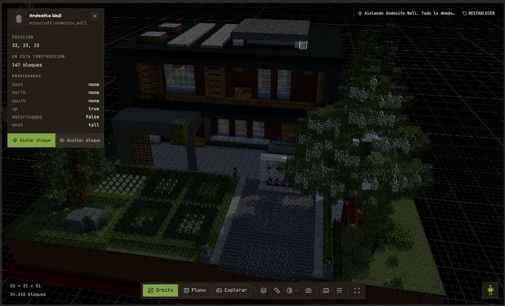
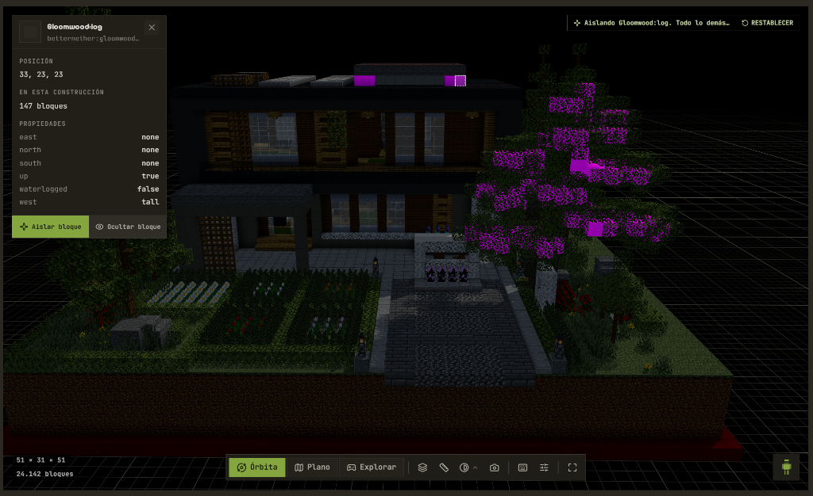

# 🧱 Minecraft NBT & Schematic Block Replacer

Una herramienta web de **código abierto**, ultraligera y minimalista para auditar, explorar y reemplazar bloques en estructuras de Minecraft (`.nbt` de Structure Blocks) y schematics (`.schem` de WorldEdit / Create) por bloques de cualquier mod (*BetterNether*, *The Aether*, *Blood Magic*, *Create*, etc.).

---

## 📸 Demostración Visual: Antes y Después

A continuación se muestra un ejemplo real de reemplazo de materiales en una estructura compleja de más de 24.000 bloques:

| 🏛️ Estructura Original (Vanilla) | 🔮 Estructura Modificada (Con Mods) |
| :---: | :---: |
|  |  |
| *Bloque original: `minecraft:andesite_wall` (147 bloques)* | *Reemplazado por: `betternether:gloomwood_log` (147 bloques)* |

---

## ✨ Características Principales

- ⚡ **Agrupación Inteligente:** Detecta automáticamente todas las variantes de rotación y estado (`facing`, `distance`, `waterlogged`, etc.) de un mismo bloque y las unifica en una sola fila. ¡Un solo clic reemplaza todas las variantes en toda la estructura!
- 🔒 **100% Client-Side y Privado:** Todo el procesamiento binario NBT y la compresión GZIP se ejecutan directamente en tu navegador mediante la API nativa de Streams. Tus archivos nunca salen de tu ordenador.
- 📐 **Soporte Multi-formato:**
  - Estructuras Vanilla de Minecraft (`.nbt` de bloques de estructura).
  - Schematics modernos de WorldEdit, Litematica y Create (`.schem` / Sponge Schematic).
- 🔍 **Explorador Técnico de Paleta:**
  - Métricas instantáneas: dimensiones $(X \times Y \times Z)$, bloques totales y tipos únicos.
  - Filtros rápidos por mod detectado (`minecraft`, `betternether`, `aether`, etc.).
  - Búsqueda en tiempo real por ID de bloque o propiedades de estado.
  - Alternador de vista: **Vista Agrupada** (tipos únicos) o **Vista Detallada** (estados individuales).
- 🛠️ **Motor de Reemplazo por Lotes:**
  - Configura múltiples reglas simultáneas.
  - Casilla para conservar íntegras las propiedades de estado para que las hojas no se caigan solas (*leaf decay*) ni se desorienten las escaleras y troncos.
- 🎨 **Estilo Industrial Minimalista:** Diseño limpio en escala de grises inspirado en Vercel, optimizado para desarrolladores y constructores.

---

## 🚀 Inicio Rápido

### Opción 1: Abrir Directamente (Sin instalación)
Haz doble clic en `index.html` para abrirlo en cualquier navegador web moderno (Google Chrome, Edge, Brave, Firefox, Safari).

### Opción 2: Servidor Local
```bash
# Con Python
python -m http.server 3000

# O con Node.js / npx
npx serve -l 3000 .
```
Abre en tu navegador: `http://localhost:3000`

### Opción 3: Despliegue en GitHub Pages
1. Sube este repositorio a GitHub.
2. Ve a **Settings** $\rightarrow$ **Pages**.
3. En **Branch**, selecciona `main` y la carpeta `/ (root)`.
4. Tu herramienta estará disponible online para todo el mundo.

---

## 📂 Estructura del Código

```text
nbt-block-replacer/
├── index.html        # Estructura semántica de la página
├── style.css         # Sistema de diseño industrial minimalista (CSS puro)
├── nbt.js            # Motor binario NBT puro (lectura, escritura y GZIP)
├── app.js            # Controlador reactivo de la UI, agrupación y reemplazos
├── assets/           # Capturas y previsualizaciones del proyecto
├── package.json      # Metadatos del proyecto y scripts
└── README.md         # Documentación del repositorio
```

---

## 🤝 Contribuciones

Las contribuciones son bienvenidas:
1. Haz un Fork del proyecto.
2. Crea tu rama de características (`git checkout -b feature/nueva-mejora`).
3. Haz commit de tus cambios (`git commit -m 'feat: añadir nueva función'`).
4. Haz push a la rama (`git push origin feature/nueva-mejora`).
5. Abre un Pull Request.

---

## 📄 Licencia

Distribuido bajo la Licencia [MIT](LICENSE). Creado para la comunidad de constructores, modders y creadores de modpacks de Minecraft.
